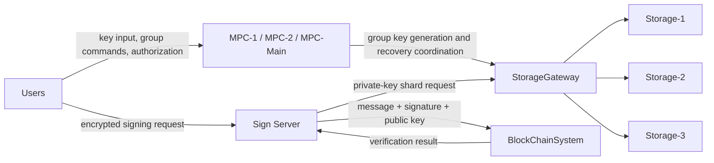
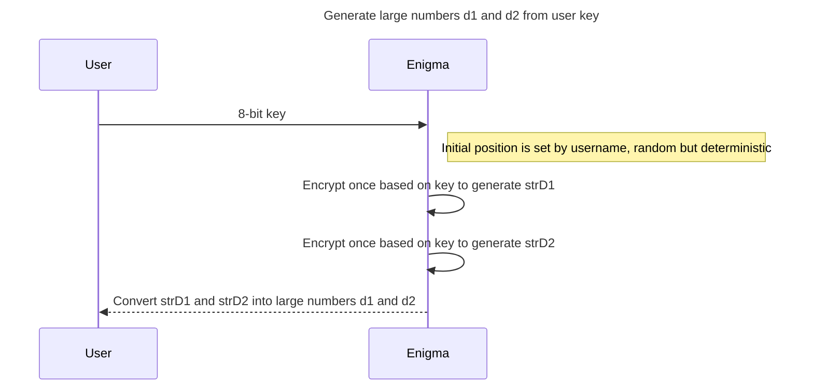
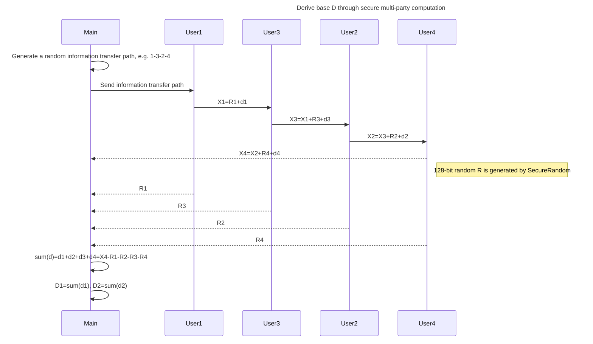
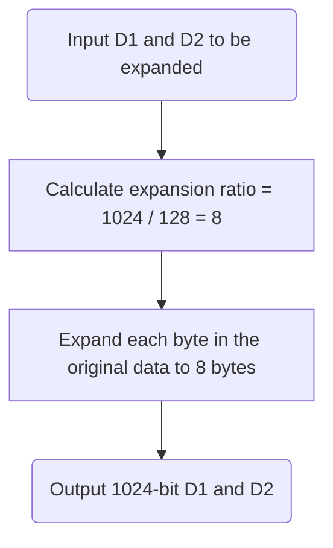
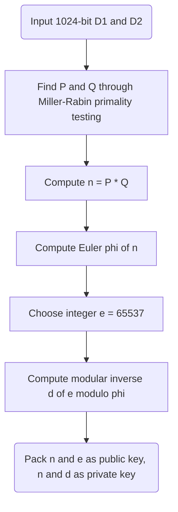
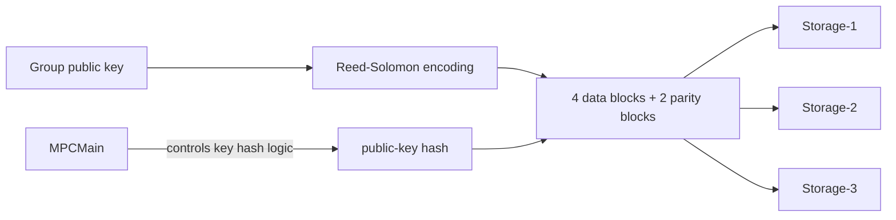
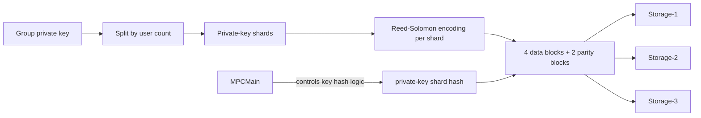
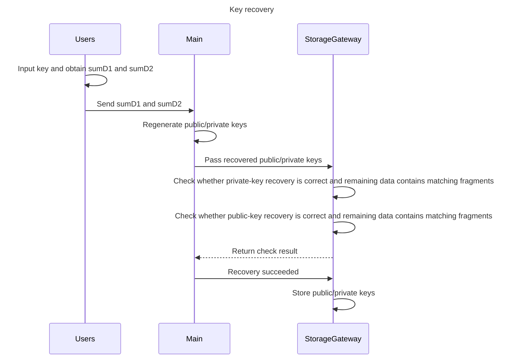

# Distributed Key Management and Multi-Party Signing Prototype

English | [中文](README.zh-CN.md)

## Project Overview

`Distributed Key Management and Multi-Party Signing Prototype` is a distributed cryptography prototype for group key generation, reliable key custody, jointly authorized signing, and recoverable keys in a multi-user environment.
Its core goal is clear: the RSA private key must not be held by any single party, signing must require multi-party authorization, private-key shards must be reliably stored in a zero-trust storage environment, and the key must be recoverable after failures.

The prototype connects users, SMPC nodes, the signing service, the storage gateway, storage providers, and blockchain-side verification into an end-to-end collaborative workflow. It is not a standalone encryption tool; it focuses on the full distributed process.

### Main Modules

| Module | Responsibility |
| --- | --- |
| Users | User-side entry point for key input, group creation, signing requests, and recovery |
| MPC-1 / MPC-2 / MPC-Main | Collaboratively perform SMPC, base D negotiation, key generation, and recovery coordination |
| Sign Server | Handles AES/RSA exchange, private-key shard lookup, and group signing |
| StorageGateway | Routes shards, resolves storage mappings, and writes recovered data back |
| Storage-1 / Storage-2 / Storage-3 | Zero-trust storage nodes that hold public-key blocks and redundant private-key shard blocks |
| BlockChainSystem | Receives messages and signatures, verifies signatures, and checks message integrity |



### Key Technical Points

- Key derivation: Enigma-style reversible encryption, with the initial position determined by username. The result is random but reproducible, and the input character range covers `a-z`, `A-Z`, and `0-9`.
- Collaborative key generation: SMPC jointly derives base D, so no single party can reverse the Key. RSA key generation uses the GMP multiple-precision arithmetic library for big-integer computation.
- Secure communication and signing: RSA is used as the core public-key algorithm for group keys and signatures. AES protects messages and signing requests, while RSA public-key encryption exchanges the AES key to establish a secure session.
- Reliable custody: Reed-Solomon erasure coding, private-key sharding, and zero-trust storage provide redundancy and prevent the full private key from existing at a single point.
- Authorization and verification: signing requires multiple online authorizers, and signed messages are checked through SHA256 digests and blockchain-side automatic signature verification.

### Tech Stack

| Category | Selection |
| --- | --- |
| Language | Java 8 |
| Build | Maven |
| Logging | SLF4J, Logback |
| Utility Libraries | Lombok, Commons Lang3 |
| Crypto Support | Spring Security Crypto |
| Big-Integer Arithmetic | GMP multiple-precision arithmetic library |
| Reliable Storage | Reed-Solomon erasure coding |

## Core Scenarios

1. Scenario 1: Key Generation and Reliable Storage
   - Step 1: Derive encrypted numbers
     - Implement an Enigma-like reversible encryption mechanism. The initial position is set by username and must be random but deterministic.
     - Encrypt key-related data twice with Enigma to obtain `d1` and `d2`. Given `d1` or `d2`, the original `Key` can be reversed.
     - The character range is `a-z`, `A-Z`, and `0-9`; alphabet substitution is not required.

   - Step 2: Derive base `D` through secure multi-party computation
     - `MPC-1`, `MPC-2`, and `MPC-Main` compute collaboratively, and no party can independently reverse the `Key`.
     - `D ∈ (max(d11,d12)+max(d21+d22), min(d11,d12)+min(d21,d22))`.
     - Design a random but deterministic selection method.

   - Step 3: Generate the RSA public and private keys
     - `MPC-Main` generates the RSA key pair from `D`.
     - Find prime `P`: it must satisfy `P >= D`, meet RSA requirements, and be the smallest valid candidate.
     - Use the GMP multiple-precision arithmetic library and the RSA key-pair generation algorithm.
     - The group identifier is formed by concatenating all user names.

   - Step 4: Reliable storage
     - The private key is not stored as a whole. It is split into private-key shards and stored under a zero-trust model, where storage providers only hold shards and cannot reconstruct the full private key.
     - Reed-Solomon erasure coding is used for redundant storage.
     - The goal is to tolerate any one failure among three storage operators while still supporting signing. Signing must require at least two users to authorize online, and storage overhead should be minimized.
     - Storage form:
       - `group identifier -> public key`
       - `(user, group identifier, shard index) -> private-key shard`
       - Private-key shards are stored with RS erasure coding.

2. Scenario 2: Joint Signing and Automatic Verification
   - Users generate an AES symmetric key and request the RSA public key from the Sign Server.
   - Users encrypt the AES key with the public key and register/pass it to the Sign Server. They then encrypt the signing request with the AES key. The request contains the username, group identifier, and other fields, producing encrypted message `EM`.
   - The Sign Server decrypts the AES key with its private key, then decrypts `EM` to recover the original message `M`.
   - The Sign Server retrieves the corresponding private-key shards from StorageGateway and waits until all/enough users authorize. The main criterion is whether the total private-key shard length satisfies the signing requirement.
   - The system generates a SHA256 hash for the message, encrypts the digest with the private key to create the digital signature, and sends `message + signature + public-key information` to the blockchain system.
   - Blockchain system:
     - Decrypts the signature with the public key to obtain hash value 1.
     - Recomputes SHA256 over the message to obtain hash value 2.
     - Compares the two hashes. If they match, the message has not been tampered with.

3. Scenario 3: Key Recovery
   - Users input `key`, obtain `sumD1` and `sumD2`, and send both to Main.
   - Main regenerates the public/private key pair and sends the recovered public key to StorageGateway.
   - StorageGateway checks whether private-key recovery is correct and whether matching fragments can be found in the remaining data.
   - After the check passes, Main reports recovery success, and StorageGateway stores the recovered private key.

## Design

### 1. Key Generation and Reliable Storage

Key generation starts from the user-provided key. The system runs the Enigma machine twice to obtain large numbers `d1` and `d2`. The initial Enigma position is set by username, making the result random but deterministic.



After obtaining `d1` and `d2`, the system derives base `D` through SMPC. `MPC-Main` randomly generates an information transfer path. Users pass the accumulated value of `d + R` along the path. After the transfer completes, each user reports their random number, and `MPC-Main` subtracts these random numbers to obtain the accumulated value of `d`. This process runs separately for `d1` and `d2`, producing `D1` and `D2`.

This design prevents users' `d1` and `d2` from being directly exposed during transmission, protecting the original key. The following diagram shows one SMPC process; deriving both `D1` and `D2` requires running SMPC twice.



The system then expands the 128-bit `D1` and `D2` proportionally to 1024 bits, finds primes `P` and `Q` through the Miller-Rabin primality test, and generates the RSA public/private key pair.





The private key is not stored as a whole. It is split into multiple private-key shards according to the number of users. Each shard is redundantly stored through Reed-Solomon erasure coding: 4 data blocks and 2 parity blocks are evenly stored across three storage providers, allowing the system to continue operating if one provider fails.

The public-key and private-key storage processes are shown below.





Storage providers use key-value hashes to store data. The hash calculation logic is controlled by `MPCMain`, and the storage mappings are:

- public-key hash -> public-key data block
- private-key shard hash -> private-key shard data block

Both public keys and private-key shards are stored through Reed-Solomon and contain 4 data blocks plus 2 parity blocks.

Storage efficiency comparison:

| Technique | Disk utilization | Compute overhead | Network overhead | Recovery efficiency |
| --- | --- | --- | --- | --- |
| Multi-replica storage (3 replicas) | 1/3 | Almost none | Low | High |
| Erasure coding (n+m) | n/(n+m) | High | Higher | Lower |

### 2. Joint Signing and Automatic Verification

During signing, the client and `SignServer` first complete key exchange. `SignServer` has its own RSA key. The user retrieves the `SignServer` public key, uses it to encrypt the symmetric key, and then communicates with `SignServer` using requests encrypted by that symmetric key.

Signing requests are not sent to the blockchain system immediately. They continue only after the number of authorizers reaches the group size. Once authorization is satisfied, `SignServer` generates the digital signature with the group private key, sends the message, signature, and public-key information to `BlockChainSystem`, and the blockchain system automatically checks whether the message has been tampered with.

```mermaid
sequenceDiagram
    title Joint signing and automatic signature verification
    participant SignServer as Sign Server
    User->>User: Generate AES symmetric key
    User->>SignServer: Get public key
    SignServer->>SignServer: Generate RSA public/private key pair
    SignServer-->>User: Return public key
    User->>User: Encrypt symmetric key with public key
    User->>SignServer: Register and pass encrypted symmetric key
    SignServer->>SignServer: Decrypt with private key to obtain symmetric key
    User->>User: Encrypt signing message M with symmetric key, including username, group identifier, and message, to obtain EM
    User->>SignServer: Pass EM
    SignServer->>SignServer: Decrypt EM with private key to obtain M
    SignServer->>StorageGateway: Get corresponding private-key shards
    StorageGateway-->>SignServer: Return private-key shards
    SignServer->>SignServer: Wait for all users to authorize, mainly checking whether total private-key shard length is valid
    SignServer->>SignServer: Generate digest hash of message through SHA256
    SignServer->>SignServer: Encrypt digest with group private key to generate digital signature
    SignServer->>BlockChainSystem: Pass letter: message + signature + public-key information
    BlockChainSystem->>BlockChainSystem: Decrypt signature with public key to obtain hash value 1
    BlockChainSystem->>BlockChainSystem: Generate digest hash value 2 from message through SHA256
    BlockChainSystem->>BlockChainSystem: Compare hash value 1 and hash value 2; equal means message was not tampered with
```

### 3. Key Recovery

When any two storage providers fail but partial data remains, the system needs to recover the key. The core idea is to convert the recovered public/private key back into data blocks and check whether matching blocks exist in the remaining storage providers. A match means the recovery is correct; otherwise recovery fails.

After successful recovery, the system regenerates the RSA key pair and writes it to the surviving storage providers. If only one storage provider remains alive, all 6 Reed-Solomon blocks are stored together on that provider, and the business workflow can continue.



## Command Reference

| Command | Description |
| --- | --- |
| `-c@group` | Create a group |
| `-j@uuid` | Join a group by uuid |
| `-gl` | List current groups |
| `-s1t@group` | Generate and store the group RSA key pair |
| `-s2t@group:message` | Start group signing; `message` is the content to sign |
| `-s3t@group` | Recover the key |

Note: `-s1t`, `-s2t`, and `-s3t` all depend on group authorization. Whether the process continues is coordinated by `MPCMain`.

## Startup Order

Start services before starting clients. The recommended order is `MPCMain`, `SignServer`, `BlockChainSystem`, `Storage-1`, `Storage-2`, `Storage-3`, then `Client`.

```bash
java -jar MPCMain.jar
java -jar SignServer.jar
java -jar BlockChainSystem.jar
java -jar Storage.jar 1
java -jar Storage.jar 2
java -jar Storage.jar 3
java -jar Client.jar
```

## Demo Screenshots

See [docs/DEMO_SCREENSHOTS.md](docs/DEMO_SCREENSHOTS.md) for the full demo screenshots and workflow captures.
