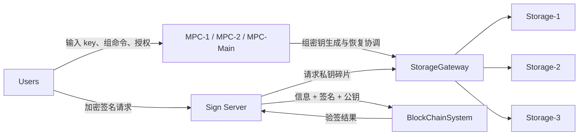
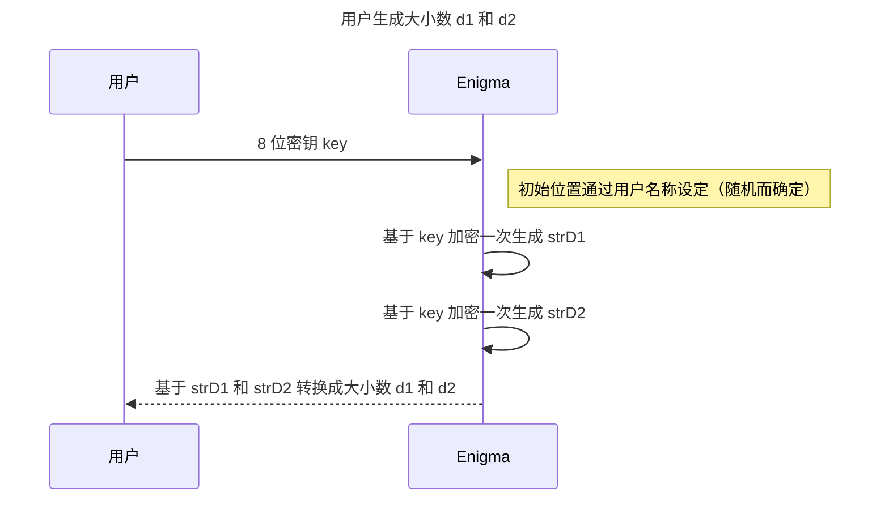
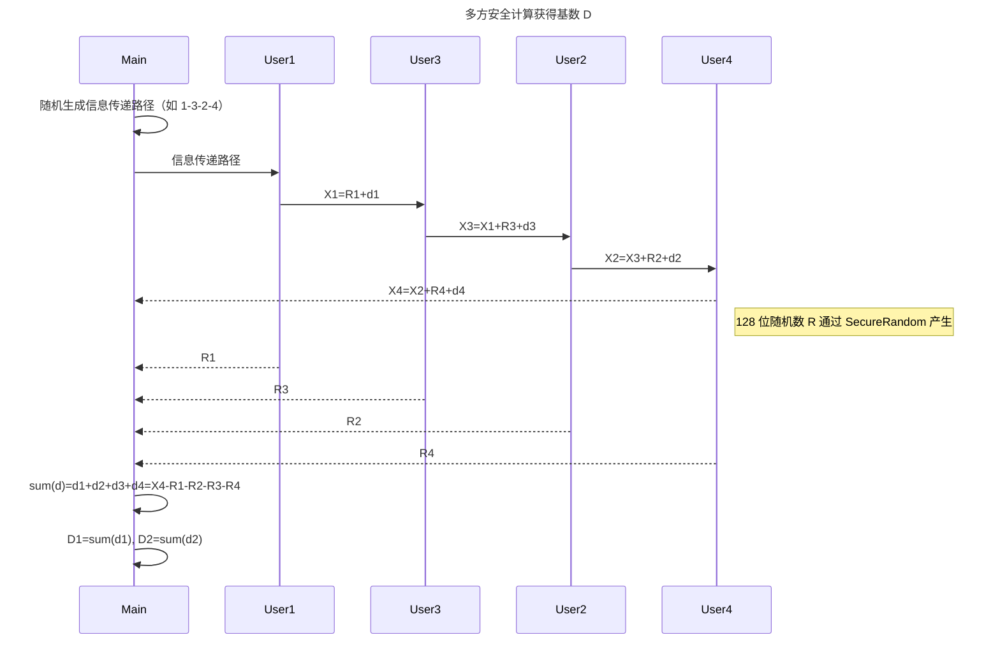
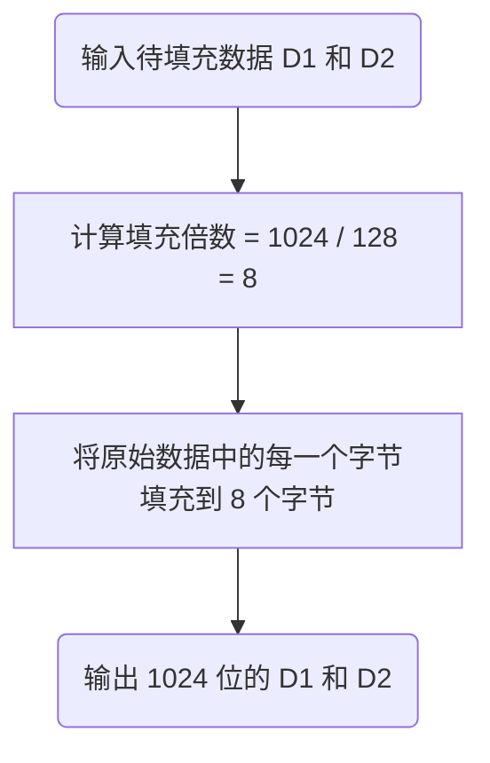
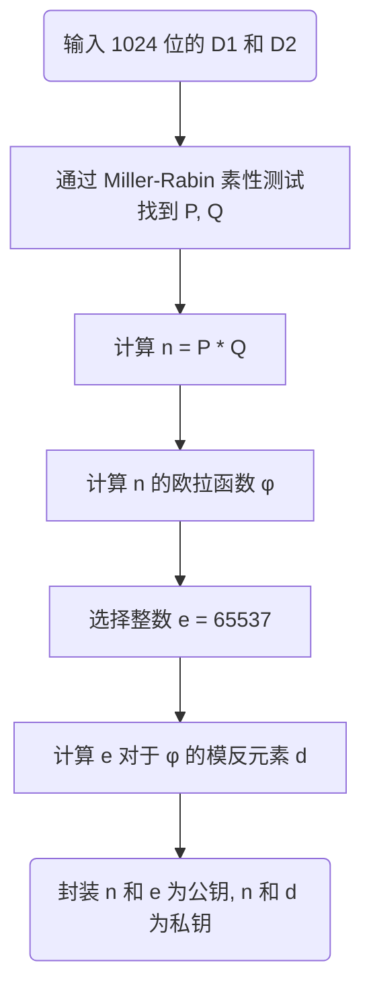
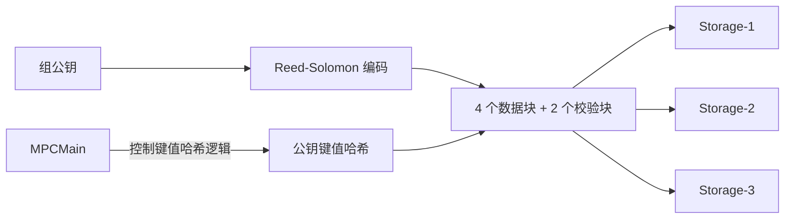
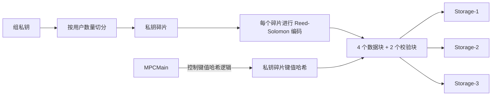
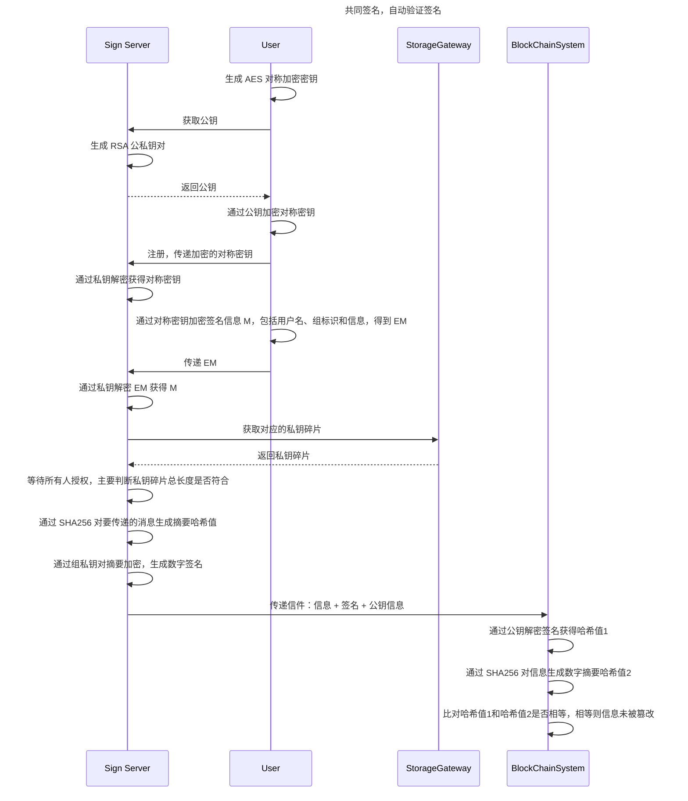
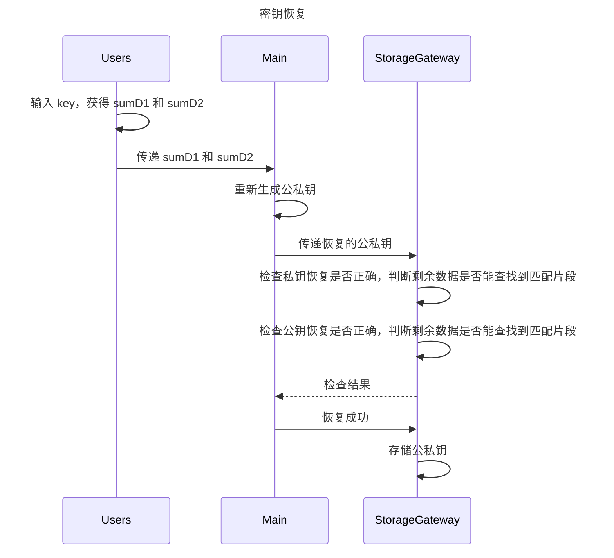

# 分布式密钥管理与多方签名原型系统

[English](README.md) | 中文

## 项目说明

`分布式密钥管理与多方签名原型系统` 解决的是多用户环境里的组密钥生成、可靠托管、共同授权签名和可恢复密钥。
它的核心目标很明确，RSA 私钥不能被任何单一参与方持有，签名必须经过多方授权，私钥碎片要放在零信任存储环境中，密钥出问题后还要能恢复。

这个原型把用户、SMPC 节点、签名服务、存储网关、存储商和链上验签串成一条完整链路，重点不是单点加密工具，而是端到端的协同流程。

### 主要模块

| 模块 | 作用 |
| --- | --- |
| Users | 用户侧入口，负责输入 key、建组、发起签名和恢复 |
| MPC-1 / MPC-2 / MPC-Main | 共同完成 SMPC、基数 D 协商、密钥生成与恢复协调 |
| Sign Server | 处理 AES/RSA 交换、定位私钥碎片、发起组签名 |
| StorageGateway | 负责碎片路由、映射查询和恢复后的写回 |
| Storage-1 / Storage-2 / Storage-3 | 零信任存储节点，保存公钥和私钥碎片冗余块 |
| BlockChainSystem | 接收消息和签名，自动验签并检查是否被篡改 |



### 关键技术点

- 密钥派生：使用 Enigma 式可逆加密，初始位置由用户名决定，结果随机但可复现，输入字符范围覆盖 `a-z`、`A-Z`、`0-9`。
- 协同密钥生成：通过 SMPC 共同得到基数 D，单方不能反推出 Key；RSA 密钥生成阶段使用 GMP 多精度运算库支撑大整数计算。
- 加密通信与签名：RSA 作为组密钥和签名的核心公私钥算法，AES 用于消息加密和签名请求保护，并通过 RSA 公钥交换 AES 密钥建立安全会话。
- 可靠托管：通过 Reed-Solomon 纠删码、私钥碎片化和零信任存储实现冗余保存，避免完整私钥落到单点。
- 授权与验证：签名前必须满足多人在线授权要求，签名消息通过 SHA256 摘要和区块链自动验签完成一致性检查。

### 技术栈

| 类别 | 选型 |
| --- | --- |
| 语言 | Java 8 |
| 构建 | Maven |
| 日志 | SLF4J, Logback |
| 工具库 | Lombok, Commons Lang3 |
| 加密支撑 | Spring Security Crypto |
| 大数运算 | GMP 多精度运算库 |
| 可靠存储 | Reed-Solomon 纠删码 |

## 核心场景

1. 场景一：密钥生成与可靠存储
   - 第一步：得到加密数
     - 实现类似 Enigma 密码机的可逆加密机制，初始位置由用户名称设定，要求“随机而确定”。
     - 对密钥相关数据进行两次 Enigma 加密，得到 `d1` 和 `d2`；知道 `d1` 或 `d2` 时，可以逆推出原始 `Key`。
     - 字符范围为 `a-z`、`A-Z`、`0-9`，不需要实现字母替换部分。

   - 第二步：通过安全多方计算得到基数 `D`
     - 由 `MPC-1`、`MPC-2`、`MPC-Main` 协作计算，任何一方都不能单独逆推出 `Key`。
     - `D ∈ (max(d11,d12)+max(d21+d22), min(d11,d12)+min(d21,d22))`。
     - 设计一个随机而确定的方法进行选择。

   - 第三步：生成 RSA 公钥和私钥
     - `MPC-Main` 根据 `D` 生成 RSA 密钥对。
     - 找素数 `P`：要求 `P >= D`、满足 RSA 要求，并在满足条件的候选中选择最小的 `P`。
     - 使用 GMP 多精度运算库和 RSA 密钥对生成算法。
     - 组标识由所有用户名字连接得到。

   - 第四步：可靠存储
     - 私钥不整体保存，而是拆成私钥碎片；采用零信任存储，存储方只保存碎片，不能获得完整私钥。
     - 采用 Reed-Solomon 纠删码做冗余存储。
     - 目标是在 3 份存储运营商中任意 1 个故障时仍可签名，签名必须至少 2 人同时在线授权，并尽量降低存储容量消耗。
     - 存储形式：
       - `组标识 -> 公钥`
       - `(用户, 组标识, 碎片索引) -> 私钥碎片`
       - 私钥碎片通过 RS 纠删码存储。

2. 场景二：共同签名与自动验证
   - 用户生成 AES 对称加密密钥，并向 Sign Server 获取 RSA 公钥。
   - 用户用公钥加密 AES 密钥并注册/传递给 Sign Server，再用 AES 密钥加密签名请求信息，信息包含用户名、组标识等，得到加密消息 `EM`。
   - Sign Server 使用私钥解密 AES 密钥，再解密 `EM` 得到原始消息 `M`。
   - Sign Server 从 StorageGateway 获取对应私钥碎片，等待所有/足够用户授权，主要判断私钥碎片总长度是否符合要求。
   - 对待签消息生成 SHA256 哈希，并使用私钥对摘要加密生成数字签名，将“信息 + 签名 + 公钥信息”传给区块链系统。
   - 区块链系统：
     - 用公钥解签名得到哈希值 1。
     - 对消息重新 SHA256 得到哈希值 2。
     - 比较两个哈希值，相等则证明消息未被篡改。

3. 场景三：密钥恢复
   - 用户输入 `key`，得到 `sumD1` 和 `sumD2`，并将二者传给 Main。
   - Main 重新生成公私钥组，并把恢复出的公钥传给 StorageGateway。
   - StorageGateway 检查私钥恢复是否正确，并判断剩余数据是否能查找到匹配片段。
   - 检查通过后返回结果，Main 通知恢复成功，StorageGateway 存储恢复后的私钥。

## 方案设计

### 1. 密钥生成与可靠存储

密钥生成从用户输入的 key 开始。系统使用 Enigma 机进行两次加密，得到大小数 `d1` 和 `d2`；Enigma 的初始位置由用户名设定，因此结果随机但可确定。



获得 `d1` 和 `d2` 后，系统通过 SMPC 得到基数 `D`。`MPC-Main` 随机生成信息传递路径，用户按照路径传递 `d + R` 的累加值；传递完成后，每个用户上报自己的随机数，`MPC-Main` 再减去这些随机数，得到 `d` 的累加值。这个过程分别执行在 `d1` 和 `d2` 上，最终得到 `D1` 和 `D2`。

这样设计可以避免用户的 `d1` 和 `d2` 在传递过程中直接暴露，从而保护原始 key 的安全性。下图展示的是一次 SMPC 流程，完整获得 `D1` 和 `D2` 需要执行两次 SMPC。



随后，系统将 128 位的 `D1` 和 `D2` 等比例扩充到 1024 位，再通过 Miller-Rabin 素性测试找到素数 `P` 和 `Q`，生成 RSA 公私钥。





私钥不会整体保存，而是根据用户数量拆成若干个私钥碎片。每个私钥碎片通过 Reed-Solomon 纠删码进行冗余存储，拆分为 4 个数据块和 2 个校验块，再平均存储到三个存储商中，从而保证一个存储商倒闭时业务仍可继续。

公钥和私钥的存储过程如下。





存储商采用键值哈希形式保存数据，键值哈希计算逻辑由 `MPCMain` 掌控，存储映射关系为：

- 公钥键值哈希 -> 公钥数据块
- 私钥碎片键值哈希 -> 私钥碎片数据块

公钥和私钥碎片都通过 Reed-Solomon 存储，均包含 4 个数据块和 2 个校验块。

存储效率对比如下：

| 两种技术 | 磁盘利用率 | 计算开销 | 网络消耗 | 恢复效率 |
| --- | --- | --- | --- | --- |
| 多副本(3副本) | 1/3 | 几乎没有 | 较低 | 较高 |
| 纠删码(n+m) | n/(n+m) | 高 | 较高 | 较低 |

### 2. 共同签名与自动验证

签名阶段由客户端和 `SignServer` 先完成密钥交换。`SignServer` 自己持有一组 RSA key，用户获取 `SignServer` 公钥后，用它加密对称密钥；后续请求信息再通过该对称密钥加密后与 `SignServer` 交互。

签名请求不会立即发送给区块链系统，而是必须等授权人数达到组人数后才会继续执行。满足授权条件后，`SignServer` 使用组私钥生成数字签名，并将消息、签名和公钥信息发送给 `BlockChainSystem`，由区块链系统自动验证消息是否被篡改。



### 3. 密钥恢复

当任意两个存储商倒闭但仍保留部分数据时，系统需要恢复密钥。核心思想是：将恢复出的公私钥重新转换成数据块，并判断剩余存储商中的数据块是否存在匹配块。匹配成功说明恢复正确，反之恢复失败。

恢复成功后，系统会重新生成 RSA 密钥对并写入存活的存储商。如果只剩一个存储商存活，6 个 Reed-Solomon 数据块会集中存放到该存储商中，随后业务可以继续运行。



## 命令参考

| 命令 | 说明 |
| --- | --- |
| `-c@group` | 创建组 |
| `-j@uuid` | 通过 uuid 加入组 |
| `-gl` | 查看当前所在的组 |
| `-s1t@group` | 生成组 RSA 密钥对并存储 |
| `-s2t@group:message` | 发起组签名，`message` 是待签名内容 |
| `-s3t@group` | 恢复密钥 |

说明：`-s1t`、`-s2t`、`-s3t` 都依赖组内授权，是否继续执行由 `MPCMain` 协调。

## 启动顺序

先启动服务，再启动客户端。建议顺序是 `MPCMain`、`SignServer`、`BlockChainSystem`、`Storage-1`、`Storage-2`、`Storage-3`，最后启动 `Client`。

```bash
java -jar MPCMain.jar
java -jar SignServer.jar
java -jar BlockChainSystem.jar
java -jar Storage.jar 1
java -jar Storage.jar 2
java -jar Storage.jar 3
java -jar Client.jar
```

## 演示截图

完整演示截图和流程截图见 [docs/DEMO_SCREENSHOTS.zh-CN.md](docs/DEMO_SCREENSHOTS.zh-CN.md)。
